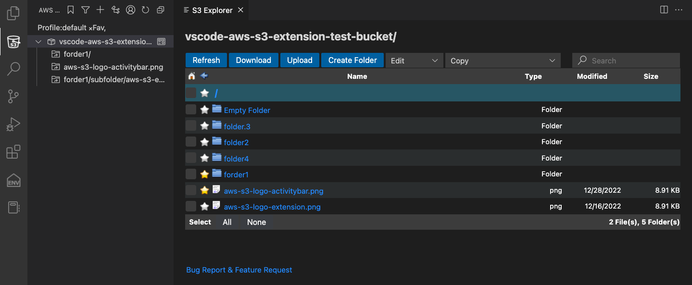
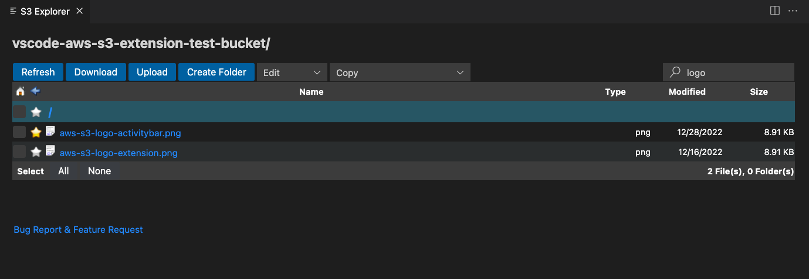
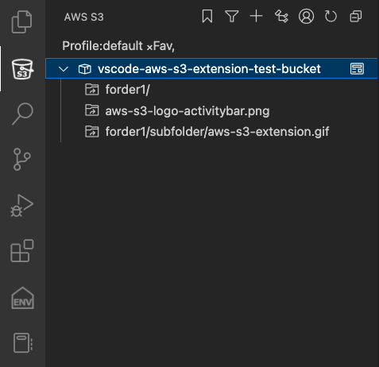
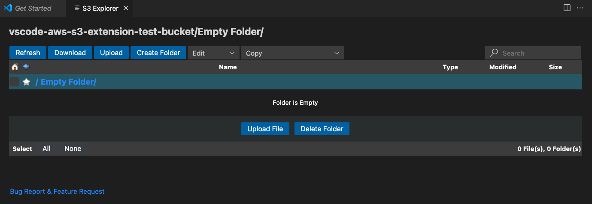
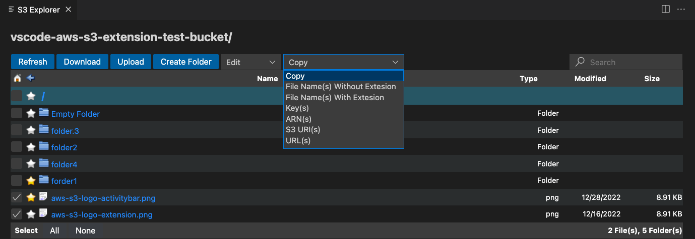

# Aws S3 

The AWS S3 Browser extension for Visual Studio Code allows users to easily browse and manage their Amazon S3 buckets, files and folders within the vscode editor.

With this extension, users can perform a variety of tasks such as 
- Uploading, downloading and deleting files
- Creating and deleting folders
- Copying file names, keys, ARNs, URLs and S3 URIs
- Adding shortcuts to files and folders for easy to access

The AWS S3 Browser extension is a useful tool for anyone working with S3, whether you are a developer, data scientist, or system administrator. \
It provides an intuitive and user-friendly interface for managing S3 resources.

## Search

## Buckets & Shortcuts

## File

## Folder

## Edit Menu

## Copy Menu

## Aws Credentials Setup
To Access Aws, you need to configure aws credentials.
For more detail on aws credentials \
https://docs.aws.amazon.com/cli/latest/userguide/cli-configure-files.html \
https://www.youtube.com/watch?v=SON8sY1iOBU

## Bug Report
To report your bugs or request new features, use link below\
https://github.com/necatiarslan/aws-s3/issues/new

## Todo
- S3.getBucketAcl to get permissions and enable/disable command buttons
- Global Search View
- Sort By Name / Type
- Delete Folder with files in it
- Write Selected File and Folder count to the bottom
- Paging (now max 1000)
- Move, Copy, Rename files
- Fix: Cannot read properties of null (reading '_panel')

Follow me on linkedin to get latest news \
https://www.linkedin.com/in/necati-arslan/

Thanks, \
Necati ARSLAN \
necatia@gmail.com